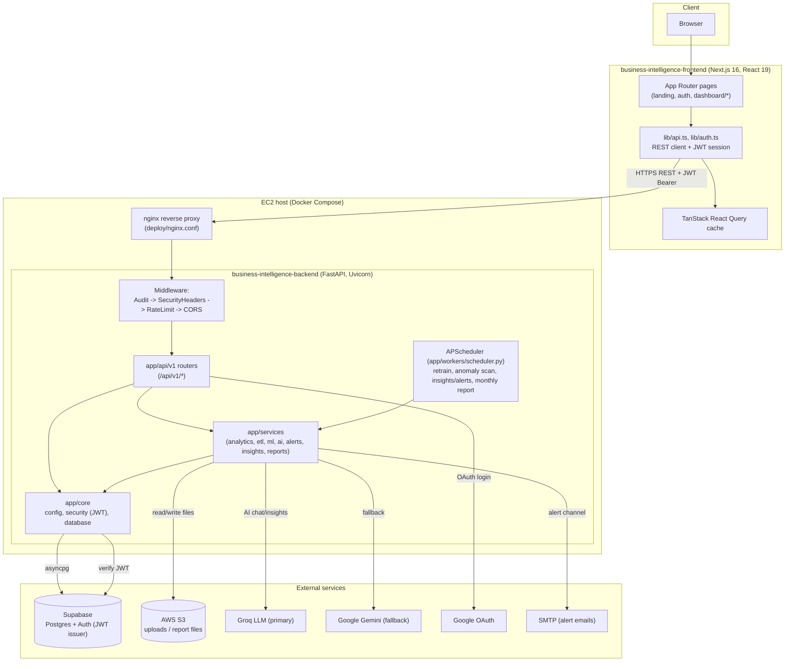
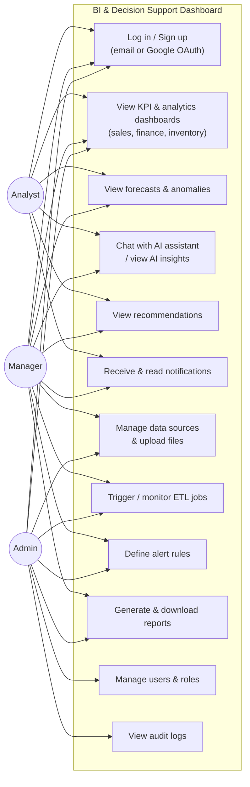
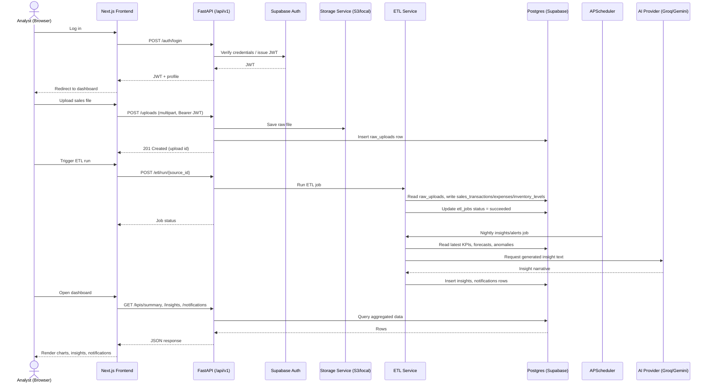
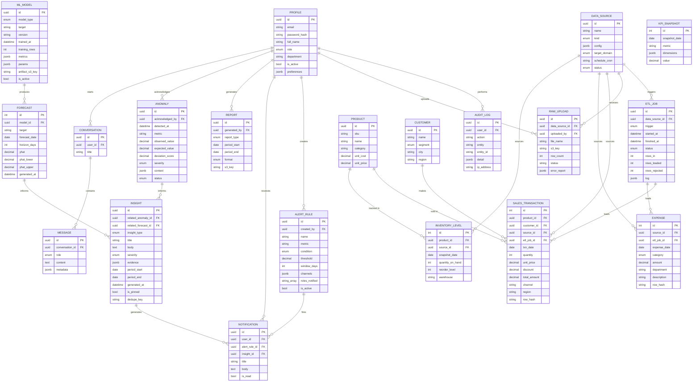

# Architecture Diagrams

## System Architecture Diagram (Implementation View)

## Use Case Diagram

## Sequence Diagram

Example flow: analyst uploads a data file, which is processed by ETL, feeds analytics/ML, and produces an insight surfaced back to the user.

## Entity Relationship Diagram

